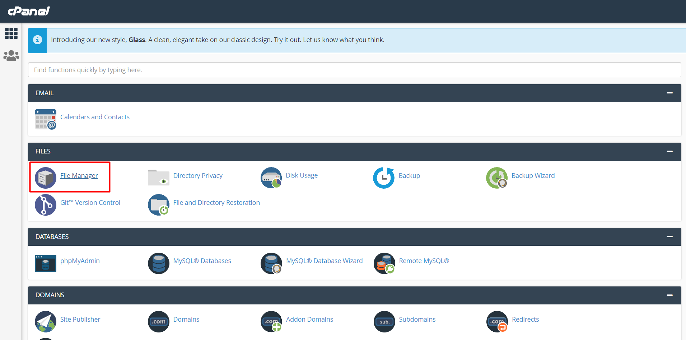
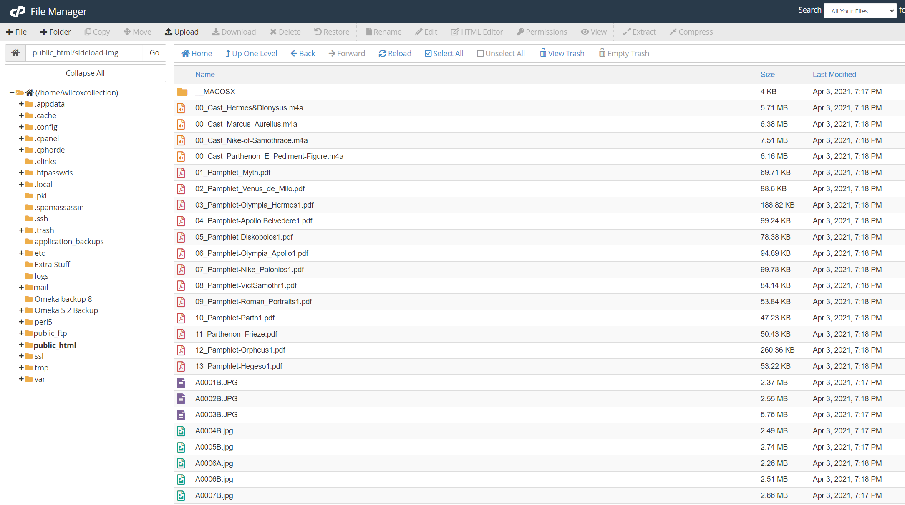
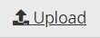
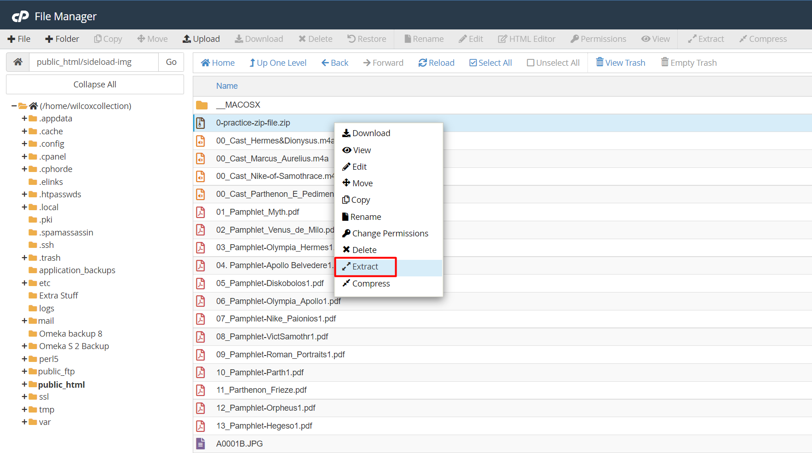
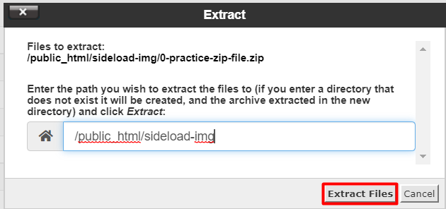
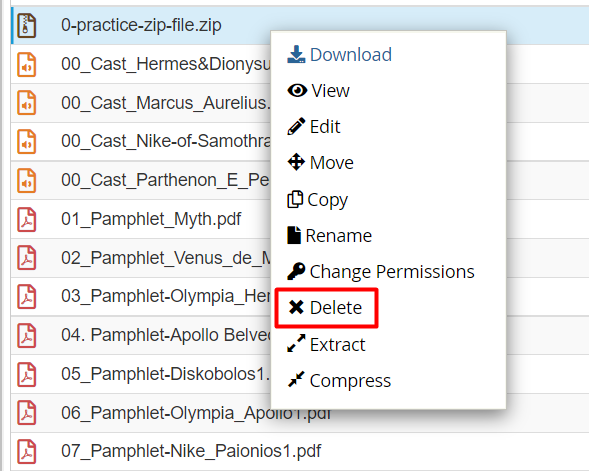
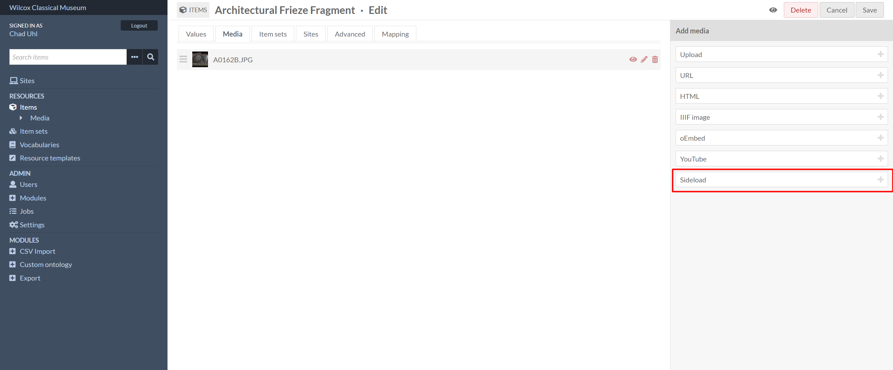
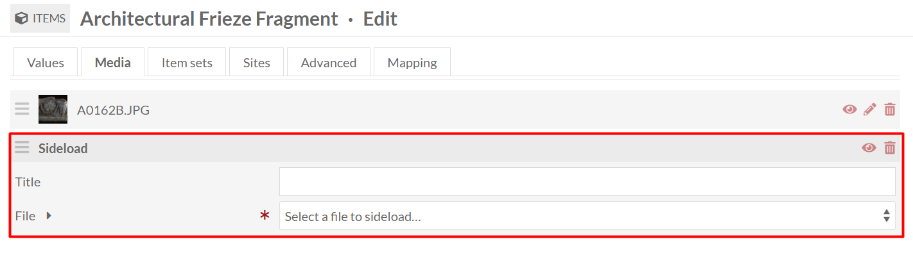
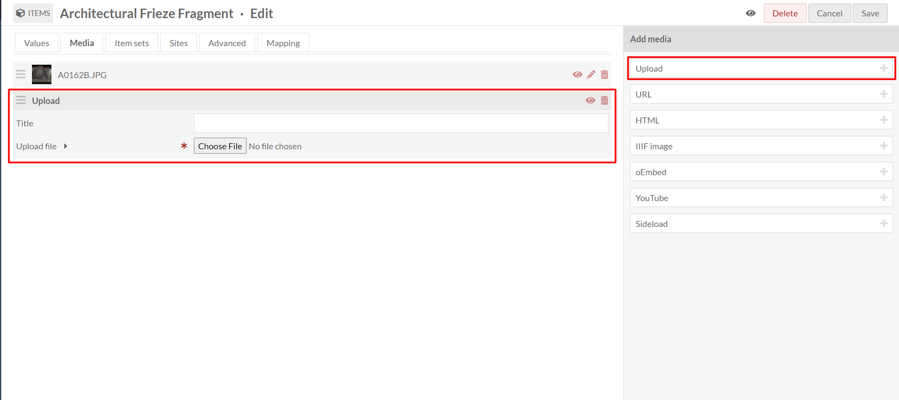

# Uploading Images

There are two ways to attach images to items in the collection:
1. Upload files in CPanel and attach them via **Sideload** (preferred)
2. Upload files individually in *Edit Item* screen

The merits and instructions for these two methods are discussed below.

## Batch Upload Images with Sideload

**Sideload** is the preferred way to upload and attach images to items since it requires the files to be uploaded to the server before they are attached to an item in the Omeka S interface. 

To upload via Sideload, first log in to CPanel at [http://wilcox.ku.edu/cpanel](http://wilcox.ku.edu/cpanel) and navigate to the **File Manager**. In the file system access `public_html/sideload-img`. This is where all the batch-uploaded images and file attachments are stored.

> **Note:** These image files have the same name as the artifact to which they belong. You must name new files accordingly so they are easily identified and selected within Omeka.

Click the **Upload** button along the top bar. 

And a new tab should open up allowing you to select local files to upload to the server. It is easiest to upload everything inside a compressed ZIP folder and then simply unzip it after uploading. Also, give it a name that starts with `0` so it appears at the top of the screen. We have a lot of files in here and it's annoying trying to scroll around and look for it. For this example, we'll name it `0-practice-zip-file.zip`.

After uploading your compressed folder, go back to the **File Manager**. You may need to hit the **Reload** button along the top bar. Right click the compressed folder and click **Extract**.

Click **Extract Files**.

The images from the compressed folder will now be unpacked into the **Sideload** folder. Once this process completes, right click the compressed folder and click **Delete**. 

These newly uploaded images may now be selected within Omeka S. Log in to the admin portal of the Wilcox site and navigate to the item for which you would like to attach a recently uploaded image. For instructions on getting to the Edit Item page, see [Managing Items](managing_items.md).

Once you have navigated to the **Edit Item** screen for your item and selected the **Media** tab, select **Sideload** from the list of options in the **Add Media** menu on the right. 

A new box will appear with fields for you to enter information for the image you wish to select for this specific item. A new box will appear every time you click the **Sideload** button in the right-hand menu.

From the dropdown menu, you can select which image from the `sideload-img` folder you wish to attach to the selected item. This dropdown list is automatically populated with whatever readable files exist in the `sideload-img` folder in CPanel. Select the appropriate file. A title is not needed. Save your changes. The site should immediately update and display the new images you have attached to the item.

---

## Upload Images Individually

This should only be done in special cases. The **Sideload** method described above is the standard way of uploading images to the site and attaching them to their respective items.

To attach an image to an item quickly, simply navigate to the **Edit Item** page and select the **Media** tab. 

Select **Upload** and a box will appear prompting you to choose a file. Click **Choose File** and upload the image you wish to attach to the item. You may do this multiple times to attach more than one image to the item. 

This method is not ideal because it is difficult to retrieve the images should the item be deleted from the site or in the event that something stops working with Omeka S. **Sideload** is always preferred over this method.